<h1 align="center">Cavasik</h1>
<div align="center">
    <a href="https://github.com/TheWisker/Cavasik">
        
    </a>
</div>
<p align="center">Audio visualizer based on CAVA</p>

<div align="center">
    </img>
</div>

<h2 align="center">Index</h2>

<div align="center">

  [Description][description]

  [Features][features]

  [Screenshots][screenshots]

  [Installation][installation]

  [Dependencies][dependencies]

  [Usage][usage]

  [Contributions][contributions]

  [Translations][translations]

  [Metrics][metrics]

  [License][license]

  [Code of Conduct][coc]

  [Credits][credits]

</div>

<h2 align="center">Description [<a href="https://github.com/TheWisker/Cavasik#index">↑</a>]</h2>

<p align="center">This is an audio visualizer based on <b>CAVA</b> with extended capabilities.</p>

<h2 align="center">Features [<a href="https://github.com/TheWisker/Cavasik#index">↑</a>]</h2>

The visualizer features:

- Five **normal** drawing modes!
- Two **circle** drawing modes!
- Three **mirror** drawing modes!
- Four drawing **directions**!
- Customizable **LibAdwaita** interface!
- Set a single color or up to a 10 color linear gradient for **background** and **foreground**!
- Select different **foreground** colors for the mirrored images in **mirror** mode!
- Set up a **color animation** that changes the colors gradually in a loop!
- Configure *smoothing*, *noise reduction* and a few other **CAVA** settings!
- Change **background** and **foreground** colors through a **DBus interface**!
- Change **background** and **foreground** colors on startup by **reading them from a file**!

<h2 align="center">Screenshots [<a href="https://github.com/TheWisker/Cavasik#index">↑</a>]</h2>

<div align="center">
    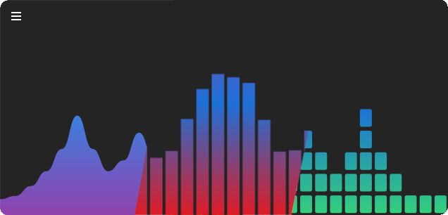</img>
</div>

<h3 align="center">Waves mode</h2>

<div align="center">
    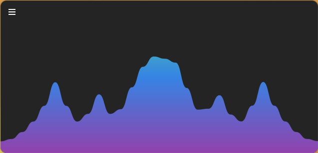</img>
</div>

<h3 align="center">Levels mode</h2>

<div align="center">
    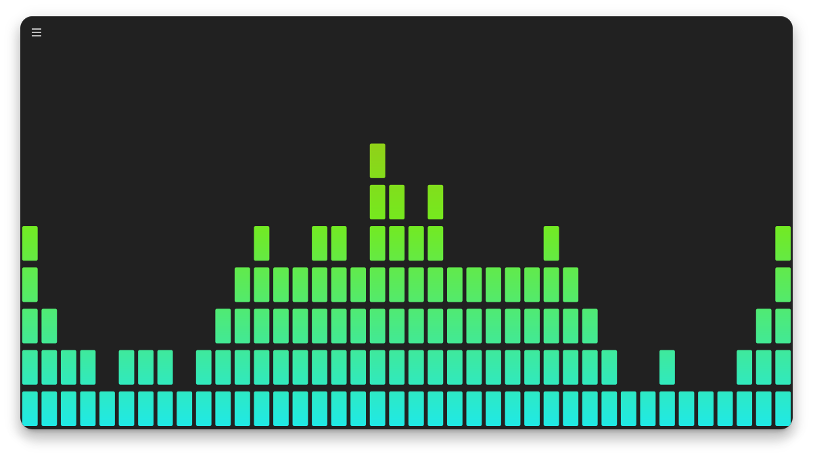</img>
</div>

<h3 align="center">Particles mode</h2>

<div align="center">
    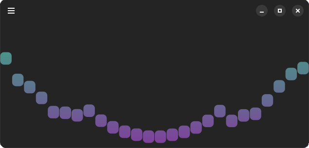</img>
</div>

<h3 align="center">Spine mode</h2>

<div align="center">
    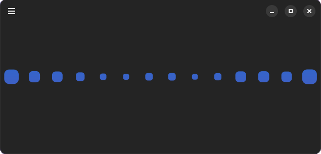</img>
</div>

<h3 align="center">Bars mode</h2>

<div align="center">
    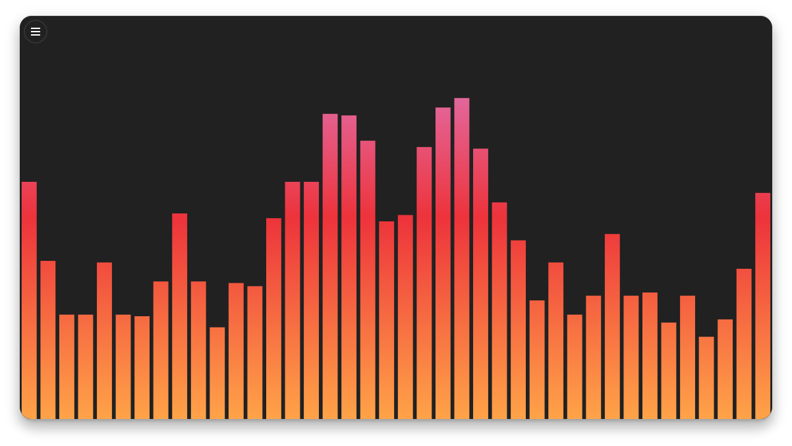</img>
</div>

<h3 align="center">Waves mode + Circle shape</h2>

<div align="center">
    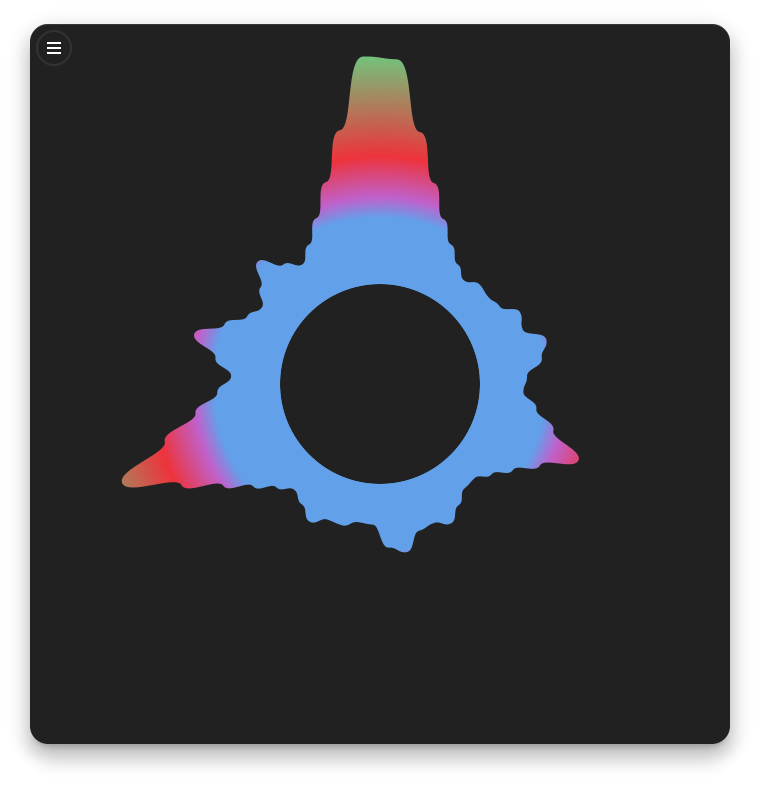</img>
</div>

<h3 align="center">Bars mode + Circle shape</h2>

<div align="center">
    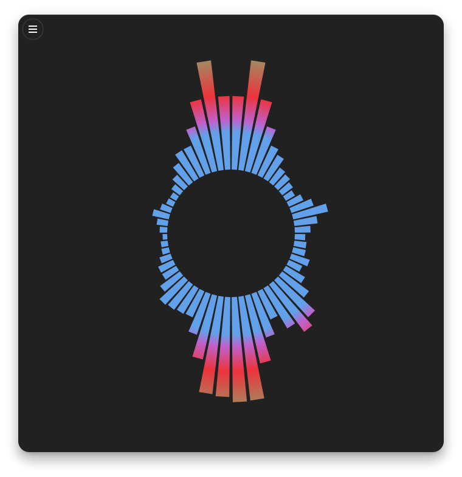</img>
</div>

<h3 align="center">Normal mirror + Waves mode</h2>

<div align="center">
    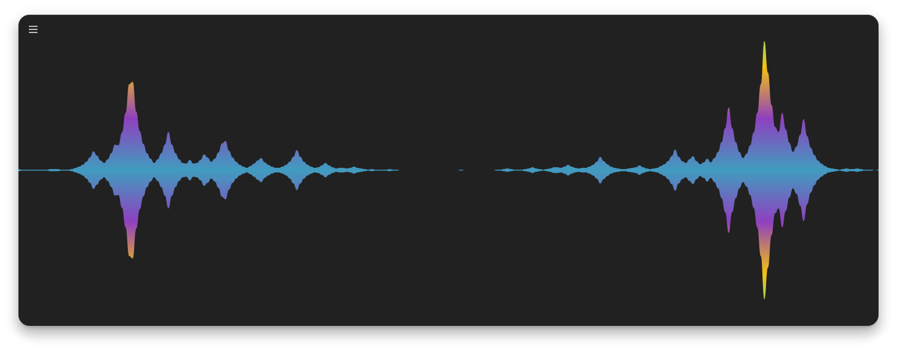</img>
</div>

<h3 align="center">Normal mirror + Bars mode</h2>

<div align="center">
    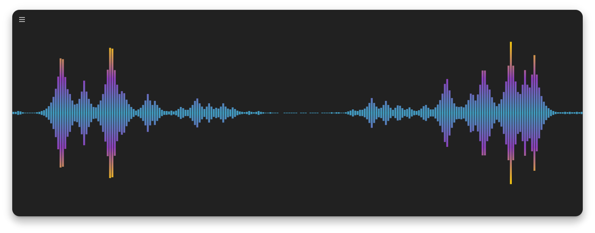</img>
</div>

<h3 align="center">Normal mirror + Levels mode</h2>

<div align="center">
    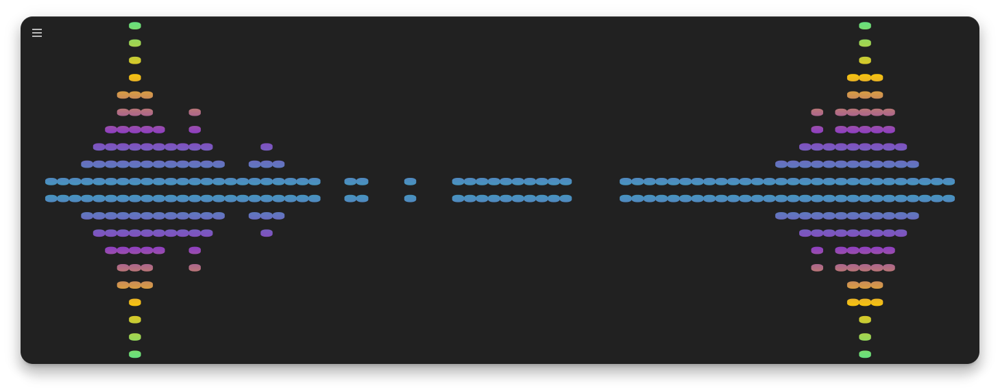</img>
</div>

<h3 align="center">Normal mirror + Waves mode + No Fill</h2>

<div align="center">
    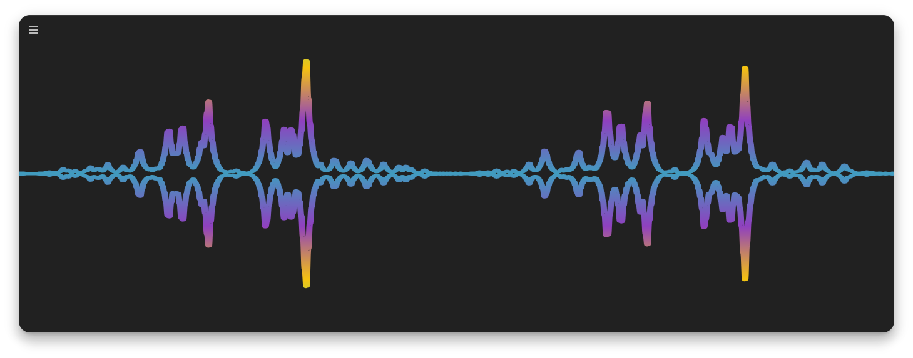</img>
</div>

<h3 align="center">Inverted mirror + Waves mode</h2>

<div align="center">
    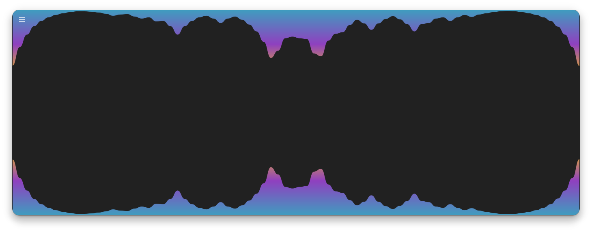</img>
</div>

<h3 align="center">Inverted mirror + Bars mode</h2>

<div align="center">
    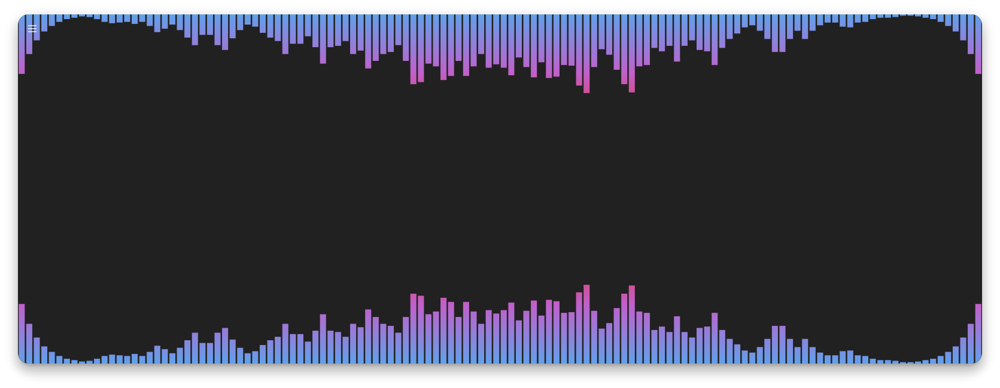</img>
</div>

<h3 align="center">Inverted mirror + Levels mode</h2>

<div align="center">
    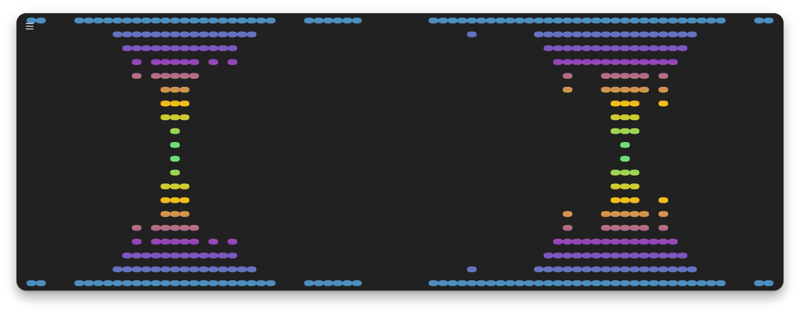</img>
</div>


<h3 align="center">Inverted mirror + Waves mode + No Fill</h2>

<div align="center">
    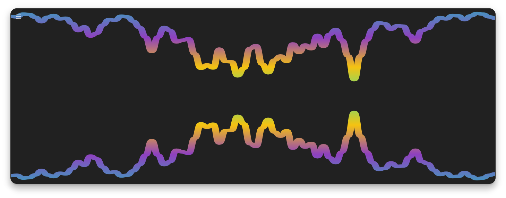</img>
</div>

<h3 align="center">Overlapping mirror + Waves mode</h2>

<div align="center">
    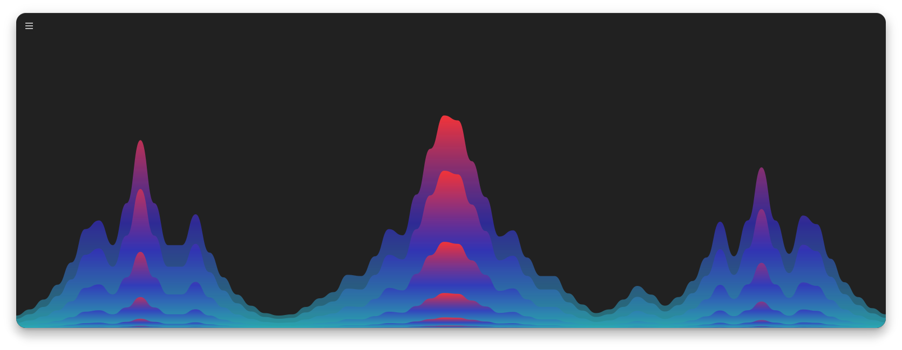</img>
</div>

<h3 align="center">Overlapping mirror + Bars mode</h2>

<div align="center">
    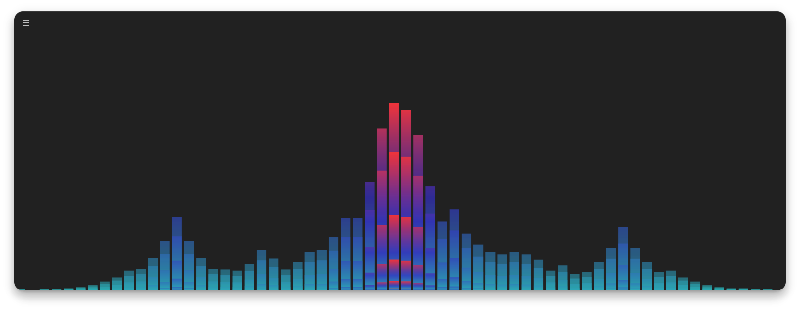</img>
</div>

<h3 align="center">Direction top-bottom + Overlapping mirror + Waves mode + No Fill</h2>

<div align="center">
    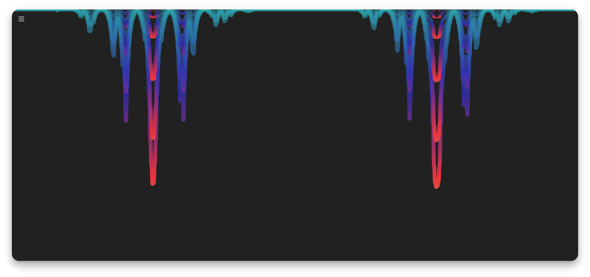</img>
</div>

<h2 align="center">Installation [<a href="https://github.com/TheWisker/Cavasik#index">↑</a>]</h2>

<h3>Flathub</h3>

You can install the **Cavasik** app from [Flathub][flathub] in its [app page][flathub-cavasik].

<a href="https://flathub.org/apps/io.github.TheWisker.Cavasik">
    </img>
</a>

- For information on how to setup a *flatpak* on any distro read [this][flatpak-setup].

<h3>Snap Store</h3>

You can install the **Cavasik** app from [Snap Store][snapstore] in its [app page][snapstore-cavasik].

<a href="https://snapcraft.io/cavasik">
    </img>
</a>

- For information on how to setup a *snap* on any distro read [this][snap-setup].

<h3>Arch Linux</h3>

You can install **Cavasik** from the [AUR][aur] repository in its [app page][aur-cavasik]:

<a href="https://aur.archlinux.org/packages/cavasik">
    </img>
</a>

- For information on how to install an [AUR][aur] package read [this][aur-wiki] wiki.

<h3>Manually</h3>

To manually install **Cavasik** start by **downloading** a [release][releases].
Then, **uncompress** the downloaded release into a resulting folder.
Make sure you have all the [dependencies][dependencies] needed.
Then, proceed to **run** the following commands:

```
#BUILD
arch-meson Cavasik build
meson compile -C build

#TEST
meson test -C build --print-errorlog

#INSTALL
meson install -C build
install -Dm644 Cavasik/LICENSE -t "/usr/share/licenses/cavasik"
```

<h2 align="center">Usage [<a href="https://github.com/TheWisker/Cavasik#index">↑</a>]</h2>


Simply start the application on your PC and enjoy. It will react to any sound your system makes, so play some music or something!

<h3 align="left">Configuration</h3>

The configuration is purely **graphical**.
To configure Cavasik, simply press <Primary+P>, usually <Ctrl+P>, having it focused or click on the menu button located on the top-left corner of the window and then Preferences.
Everything is documented there, I believe its pretty straightforward but if you don't understand something or believe it could be explained better open an Issue or a PR!

<h3 align="left">Startup Colors</h3>

To have the colors of Cavasik change on startup, simply enable this option in the settings and specify a **file** to get the colors from.
The file must contain only **one** color **per line** in **RGB** format, like, for example:

```
0,0,0
160,160,160
255,255,255
```
> Changing the colors overwrites default profile.

> ⚠️ **Snap Package Warning**:
> When using the **Snap version** of Cavasik, the app cannot access hidden files in your home directory (like `~/.cache/wal/colors.rgb`) due to Snap confinement.
>
> To enable theme coloring at startup, make sure a copy or symbolic link of your color file exists under:
>
> - `$XDG_CONFIG_HOME/cavasik` or `~/.config/cavasik`
>
> Example:
>
> ```sh
> mkdir -p ~/.config/cavasik
> ln -s ~/.cache/wal/colors.rgb ~/.config/cavasik/colors.rgb
> ```

<h3 align="left">DBus Interface</h3>

Cavasik also provides a DBus Interface to change the colors like we can do on startup but on demand.
This interface allows us to set the foreground or background colors by sending a signal to Cavasik's DBus interface and specifying a **file** to get the colors from.

> The color file must have the same structure that the startup colors one.

The interface has the following structure:

```xml
<interface name='io.github.TheWisker.Cavasik'>
    <method name='set_fg_colors'>
        <arg type='s' name='path' direction='in'/>
        <arg type='b' name='state' direction='out'/>
    </method>
    <method name='set_bg_colors'>
        <arg type='s' name='path' direction='in'/>
        <arg type='b' name='state' direction='out'/>
    </method>
</interface>
```

So, we can use this in a script to dynamically and on demand set Cavasik's colors, like:

```bash
# Must be called under same user that started Cavasik
dbus-send \
--session \
--type=method_call \
--dest="io.github.TheWisker.Cavasik" \
"/io/github/TheWisker/Cavasik" "io.github.TheWisker.Cavasik.set_fg_colors" \ # Use 'set_bg_colors' for background colors
string:"${HOME}/.cache/wal/colors.rgb"
```

> Changing the colors overwrites default profile.

<h3 align="left">Command line</h3>

Cavasik also features a **simple command** line:

Usage: cavasik [OPTIONS]

Help with OPTIONS:

--version: Prints the current version.

--set-fg [FILE]: Sets the foreground to the colors read from the **file**.

--set-bg [FILE]: Sets the background to the colors read from the **file**.

--help: Prints this help.

> The color file must have the same structure that the startup colors one.

> Changing the colors overwrites default profile.

<h3 align="left">Pywal Integration</h3>

You can easily make Cavasik follow your [Pywal](https://github.com/dylanaraps/pywal) colorscheme.
Simply enable startup colors, as to make the colors change on startup, and set the startup colors file to be `~/.cache/wal/colors.rgb`, for example.
Now, you need to add a Pywal template file that will be used to generate the colorscheme in a way Cavasik understands and using your desired colors.
For this, simply create a file under `~/.config/wal/templates` with the same name as the one you set under `~/.cache/wal/`, for example, `colors.rgb`.
Then, write the colors into the file in RGB format, for example:

```bash
{color1.rgb}
{color2.rgb}
{color3.rgb}
```

These will be substituted when Pywal runs. You can use more or less colors and any of **{color0}** to **{color15}** and **{background}** or **{foreground}**, ending with *.rgb*.
Now, if you run Pywal before starting Cavasik, it will pick up Pywal's colors. If you also intend to run Pywal when Cavasik is running and don't want to have to restart it, you need to make use of the DBus Interface.
Simply create a bash script and add inside it:

```bash
# Must be called under same user that started Cavasik
dbus-send \
--session \
--type=method_call \
--dest="io.github.TheWisker.Cavasik" \
"/io/github/TheWisker/Cavasik" "io.github.TheWisker.Cavasik.set_fg_colors" \
string:"${HOME}/.cache/wal/colors.rgb" # Or whatever you called it
```

> Don't forget to make it executable: chmod +x /path/to/script

Then, simply when running Pywal use its script execute option, or execute it manually after Pywal:

```bash
wal -o /path/to/script OTHER_ARGS
```

Or

```bash
wal OTHER_ARGS
/path/to/script
```

> I recommend you save the script under /.config/wal/scripts.

Now you have set up Cavasik to use Pywal's colors!

<h2 align="center">Dependencies [<a href="https://github.com/TheWisker/Cavasik#index">↑</a>]</h2>

<h3 align="left">Buildtime</h3>

The **Cavasik** application has the following *buildtime* dependencies:

- [meson][meson]

<h3 align="left">Runtime</h3>

The **Cavasik** application has the following *runtime* dependencies:

- [cava][cava]
- [gtk4][gtk4]
- [libadwaita][libadwaita]
- [python-gobject][python-gobject]
- [python-cairo][python-cairo]
- [python-pydbus][python-pydbus]

<h2 align="center">Contributions [<a href="https://github.com/TheWisker/Cavasik#index">↑</a>]</h2>

First and foremost, all contributions are welcome!
The **steps** involved when making a contribution are **explained** in the [CONTRIBUTING.md][contributing] file.
We look forward to your contributions!

- The **contributors** list is located [here][contributors].

<h2 align="center">Translations [<a href="https://github.com/TheWisker/Cavasik#index">↑</a>]</h2>

Secondly, all translations are also welcome!
The **steps** involved when making a translation are **explained** in the [CONTRIBUTING.md][contributing] file.
More **specific steps** can be found in the [CONTRIBUTING.md][lang-contributing] file in the `/lang` folder.
We look forward to your translations!

- The **credits** of the translators are located [here][translator-credits].

<h2 align="center">Metrics [<a href="https://github.com/TheWisker/Cavasik#index">↑</a>]</h2>

<div align="center">
  <picture>
    
  </picture>
</div>

<div align="center">
  <picture>
    
  </picture>
</div>

<h2 align="center">License [<a href="https://github.com/TheWisker/Cavasik#index">↑</a>]</h2>

<div align="center">
  <picture>
    
  </picture>
</div>

<h2 align="center">Code of Conduct [<a href="https://github.com/TheWisker/Cavasik#index">↑</a>]</h2>

<p align="center"> This project follows the <a href="./.github/CODE_OF_CONDUCT.md"><b>Contributor Covenant Code of Conduct</b></a>.</p>

<h2 align="center">Credits [<a href="https://github.com/TheWisker/Cavasik#index">↑</a>]</h2>

<div align="center">

| Author | Forked From |
| ------------- | ------------- |
| <a href="https://github.com/TheWisker"></img></a>  | <a href="https://github.com/fsobolev"></img></a>  |
| TheWisker | Fsobolev |

</div>

[description]: https://github.com/TheWisker/Cavasik#description-
[features]: https://github.com/TheWisker/Cavasik#features-
[screenshots]: https://github.com/TheWisker/Cavasik#screenshots-
[installation]: https://github.com/TheWisker/Cavasik#installation-
[usage]: https://github.com/TheWisker/Cavasik#usage-
[dependencies]: https://github.com/TheWisker/Cavasik#dependencies-
[contributions]: https://github.com/TheWisker/Cavasik#contributions-
[translations]: https://github.com/TheWisker/Cavasik#translations-
[metrics]: https://github.com/TheWisker/Cavasik#metrics-
[license]: https://github.com/TheWisker/Cavasik#license-
[coc]: https://github.com/TheWisker/Cavasik#code-of-conduct-
[credits]: https://github.com/TheWisker/Cavasik#credits-
[flathub]: https://flathub.org/
[flathub-cavasik]: https://flathub.org/apps/io.github.TheWisker.Cavasik
[flatpak-setup]: https://flatpak.org/setup/
[snapstore]: https://snapcraft.io/store
[snapstore-cavasik]: https://snapcraft.io/cavasik
[snap-setup]: https://snapcraft.io/docs/get-started
[aur]: https://aur.archlinux.org/
[aur-cavasik]: https://aur.archlinux.org/packages/cavasik
[aur-wiki]: https://wiki.archlinux.org/title/Arch_User_Repository
[releases]: https://github.com/TheWisker/Cavasik/releases/
[meson]: https://mesonbuild.com/
[cava]: https://github.com/karlstav/cava
[gtk4]: https://docs.gtk.org/gtk4/
[libadwaita]: https://gitlab.gnome.org/GNOME/libadwaita
[python-gobject]: https://pygobject.readthedocs.io/en/latest/
[python-cairo]: https://pycairo.readthedocs.io/en/latest/
[python-pydbus]: https://pydbus.readthedocs.io/en/latest/gettingstarted.html
[contributing]: ./CONTRIBUTING.md
[contributors]: ./CONTRIBUTORS.md
[lang-contributing]: ./lang/CONTRIBUTING.md
[translator-credits]: ./lang/CREDITS.json
