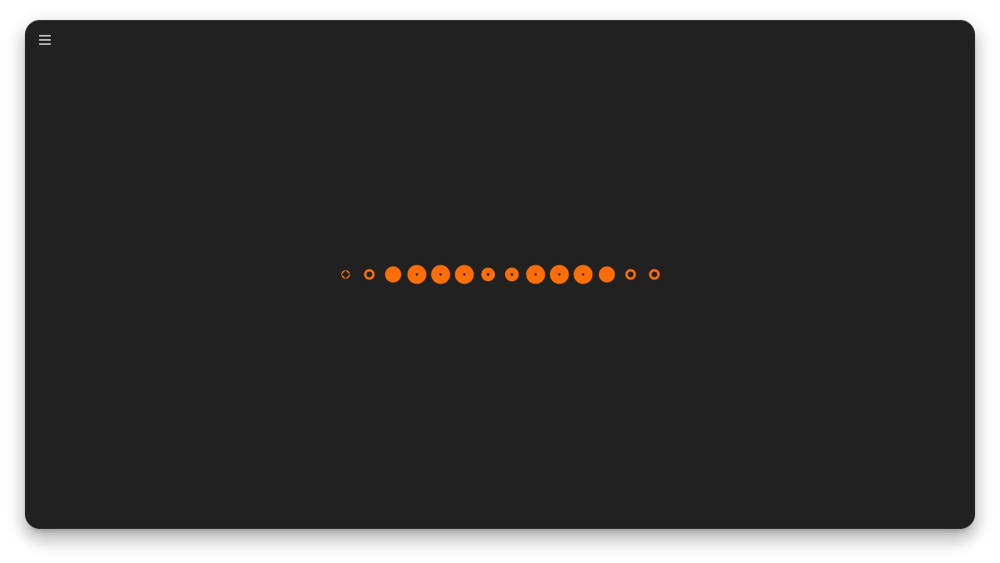

<h1 align="center">Cavasik</h1>

    

Audio visualizer based on CAVA

<h2 align="center">Description</h2>

This is an audio visualizer based on CAVA with expanded capabilities.

<h2 align="center">Details</h2>

The visualizer features:

- Five normal drawing modes!
- Two circle drawing modes!
- Three mirror drawing modes!
- Four drawing directions!
- Customizable LibAdwaita interface!
- Set a single color or up to a 10 color linear gradient for background and foreground!
- Select different foreground colors for the mirrored images in mirror mode!
- Set up a color animation that changes the colors gradually in a loop!
- Configure smoothing, noise reduction and a few other CAVA settings!
- Change background and foreground colors through a DBus interface!

<h2 align="center">Screenshots</h2>

<h3 align="left">Waves mode</h2>

<h3 align="left">Levels mode</h2>

<h3 align="left">Particles mode</h2>

<h3 align="left">Spine mode</h2>

<h3 align="left">Bars mode</h2>

<h3 align="left">Normal mirror + Waves mode</h2>

<h3 align="left">Inverted mirror + Waves mode</h2>

<h3 align="left">Overlapping mirror + Waves mode</h2>

<h3 align="left">Direction top-bottom + Waves mode</h2>

<h3 align="left">Normal mirror + Direction left-right + Waves mode</h2>

<h2 align="center">Installation</h2>

<h2 align="center">Forked</h2>

    </img>

<h4 align="center">Fsobolev</h4>

<h2 align="center">Author</h2>

    </img>

<h4 align="center">TheWisker</h4>

**Cavasik** is an audio visualizer based on [CAVA](https://github.com/karlstav/cava) with customizable LibAdwaita interface.
* 4 drawing modes!
* Set single color or up to 10 colors gradient for background and foreground.
* Configure smoothing, noise reduction and a few other CAVA settings.
* Change background and foreground colors through a DBus interface.

## DBus Interface

The application publishes the *io.github.TheWisker.Cavasik* DBus interface with the following methods:
- set_fg_colors(path: str) => bool: Sets the foreground colors sourcing them from the specified file
- set_bg_colors(path: str) => bool: Sets the background colors sourcing them from the specified file
Both methods return a booleand indicating the success of the operation.

The files must have the following format:
r,g,b
r,g,b,a 
10,10,10
10,10,10,0.1

This interface provides the ability to change colors dynamically from a bash file:

interface=io.github.TheWisker.Cavasik
object=/io/github/TheWisker/Cavasik
method=set_fg_colors
argument="~/colors-rgb"

dbus-send --session --dest=$interface --type=method_call --print-reply $object $interface.$method string:$argument

Thus, it can be integrated with tools like Pywal letting you change the colors of Cavasik dynamically to match the wallpaper.

## Building

The easiest way to build the development version of Cavasik is by using GNOME Builder as described [here](https://wiki.gnome.org/Newcomers/BuildProject).

## Translations

See [instruction](po/README.md) on how to translate the app to your language.

## Code of Conduct

This project follows the [GNOME Code of Conduct](https://wiki.gnome.org/Foundation/CodeOfConduct).
