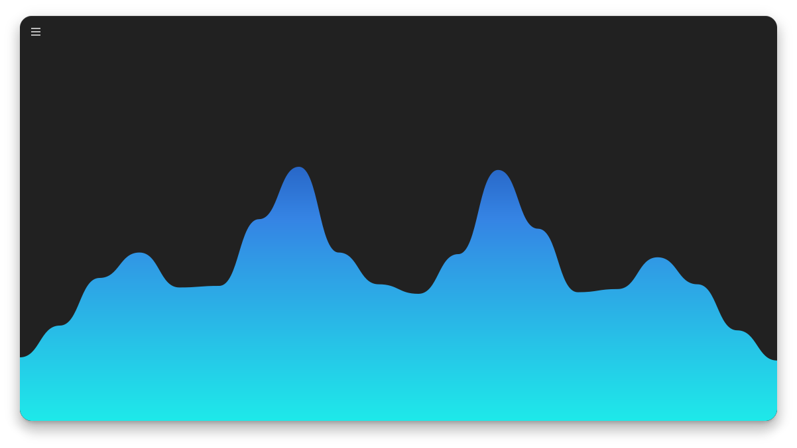

<h1 align="center">Cavasik</h1>
<div align="center">
    
</div>
<p align="center">Audio visualizer based on CAVA</p>

<h2 align="center">Description</h2>

<p align="center">This is an audio visualizer based on <b>CAVA</b> with extended capabilities.</p>

<h2 align="center">Features</h2>

The visualizer features:

- Five **normal** drawing modes!
- Two **circle** drawing modes!
- Three **mirror** drawing modes!
- Four drawing **directions**!
- Customizable **LibAdwaita** interface!
- Set a single color or up to a 10 color linear gradient for **background** and **foreground**!
- Select different **foreground** colors for the mirrored images in **mirror** mode!
- Set up a **color animation** that changes the colors gradually in a loop!
- Configure *smoothing*, *noise reduction* and a few other **CAVA** settings!
- Change **background** and **foreground** colors through a **DBus interface**!

<h2 align="center">Screenshots</h2>

<div align="center">
    </img>
</div>

<h3 align="center">Waves mode</h2>

<div align="center">
    </img>
</div>

<h3 align="center">Levels mode</h2>

<div align="center">
    </img>
</div>

<h3 align="center">Particles mode</h2>

<div align="center">
    </img>
</div>

<h3 align="center">Spine mode</h2>

<div align="center">
    </img>
</div>

<h3 align="center">Bars mode</h2>

<div align="center">
    </img>
</div>

<h3 align="center">Normal mirror + Waves mode</h2>

<div align="center">
    </img>
</div>

<h3 align="center">Inverted mirror + Waves mode</h2>

<div align="center">
    </img>
</div>

<h3 align="center">Overlapping mirror + Waves mode</h2>

<div align="center">
    </img>
</div>

<h3 align="center">Direction top-bottom + Waves mode</h2>

<div align="center">
    </img>
</div>

<h3 align="center">Normal mirror + Direction left-right + Waves mode</h2>

<div align="center">
    </img>
</div>

<h2 align="center">Installation</h2>

<h3>Flathub</h3>

You can install the **Cavasik** app from [Flathub][flathub] in its [app page][flathub-cavasik].

<a href="https://flathub.org/apps/details/io.github.TheWisker.Cavasik">

</a>

- For information on how to setup *flatpak* on any distro read [this][flatpak-setup].

<h3>Arch Linux</h3>

You can install **Cavasik** from the [AUR][aur] repository:

<a href="https://aur.archlinux.org/packages/cavasik">

</a>

- For information on how to install an [AUR][aur] package read [this][aur-wiki] wiki.

<h3>Manually</h3>

To manually install **Cavasik** start by **downloading** a [release][releases].
Then, **uncompress** the downloaded release into a resulting folder.
Make sure you have all the [dependencies][dependencies] needed.
Then, proceed to **run** the following commands:

```
#BUILD
arch-meson Cavasik build
meson compile -C build

#TEST
meson test -C build --print-errorlog

#INSTALL
meson install -C build
install -Dm644 Cavasik/LICENSE -t "/usr/share/licenses/cavasik"
```

<h2 align="center">Dependencies</h2>

<h3 align="left">Buildtime</h3>

The **Cavasik** application has the following *buildtime* dependencies:

- [meson][meson]

<h3 align="left">Runtime</h3>

The **Cavasik** application has the following *runtime* dependencies:

- [cava][cava]
- [libadwaita][libadwaita]
- [python-gobject][python-gobject]
- [python-cairo][python-cairo]
- [python-pydbus][python-pydbus]

<h2 align="center">Contributions</h2>

First and foremost, all contributions are welcome!
The **steps** involved when making a contribution are **explained** in the [CONTRIBUTING.md][contributing] file.
We look forward to your contributions!

- The **contributors** are located [here][contributors].

<h2 align="center">Translations</h2>

Secondly, all translations are also welcome!
The **steps** involved when making a translation are **explained** in the [CONTRIBUTING.md][contributing] file.
More **specific steps** can be found in the [CONTRIBUTING.md][lang-contributing] file in the `/lang` folder.
We look forward to your translations!

- The **credits** of the translators are located [here][translator-credits].

<h2 align="center">Code of Conduct</h2>

<p align="center"> This project follows the <a href="./.github/CODE_OF_CONDUCT.md"><b>Covenant Code of Conduct</b></a>.</p>

[flathub]: https://flathub.org/
[flathub-cavasik]: x
[flatpak-setup]: https://flatpak.org/setup/
[aur]: https://aur.archlinux.org/
[aur-wiki]: https://wiki.archlinux.org/title/Arch_User_Repository
[releases]: x
[dependencies]: https://github.com/TheWisker/Cavasik#dependencies
[meson]: https://mesonbuild.com/
[cava]: https://github.com/karlstav/cava
[libadwaita]: https://gitlab.gnome.org/GNOME/libadwaita
[python-gobject]: https://pygobject.readthedocs.io/en/latest/
[python-cairo]: https://pycairo.readthedocs.io/en/latest/
[python-pydbus]: https://pydbus.readthedocs.io/en/latest/gettingstarted.html
[contributors]: ./CONTRIBUTORS.md
[contributing]: ./CONTRIBUTING.md
[lang-contributing]: ./lang/CONTRIBUTING.md
[translator-credits]: ./lang/CREDITS.json

<h2 align="center">Credits</h2>

<div align="center">
    
| Author | Forked From |
| ------------- | ------------- |
| <a href="https://github.com/TheWisker"></img></a>  | <a href="https://github.com/fsobolev"></img></a>  |
| TheWisker | Fsobolev |

</div>
