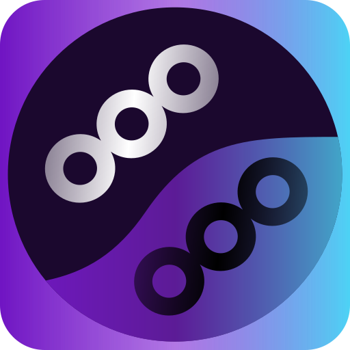

<h1 align="center">Cavasik</h1>

    

Audio visualizer based on CAVA

<h2 align="center">New Translations</h2>

If you want to make a translation, thank you, you're awesome!

Here are the instructions to make a translation:

- Make a fork of the repository.
- Clone said fork.
- (Optional) Use a specialized editor like [poedit](https://poedit.net/).
- Create a `<locale_code>.po` file in the `po` directory.
- Copy the contents of `cavasik.pot` template to said file.
- Work with the new `.po` file using a normal or a specialized editor.
- When the translation is finished, add the locale code to the `LINGUAS` file keeping it alphabetically sorted.
- Then, to take authorship, edit the `CREDITS.json` file adding a new entry following the same pattern as the other ones. If you made multiple translations use an array of languages in the "lang" entry.
- Add, commit and push the changes to the forked repository.
- Lastly, open a new Pull Request with the new changes made!

Thank you for everyone willing to sacrifice their time to help this project grow!

<h2 align="center">Forked</h2>

    </img>

<h4 align="center">Fsobolev</h4>

<h2 align="center">Author</h2>

    </img>

<h4 align="center">TheWisker</h4>
